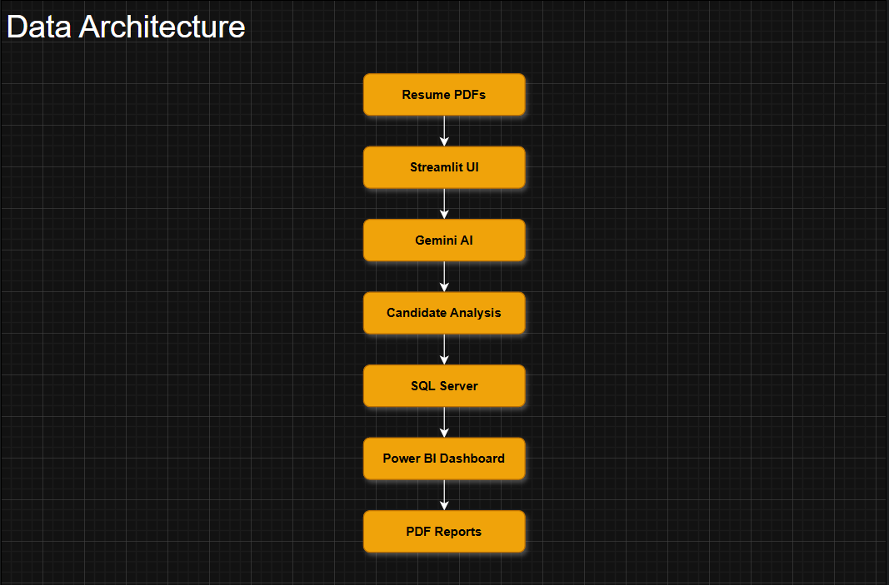
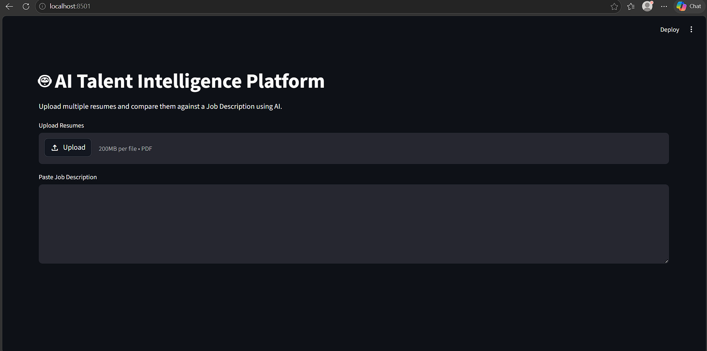
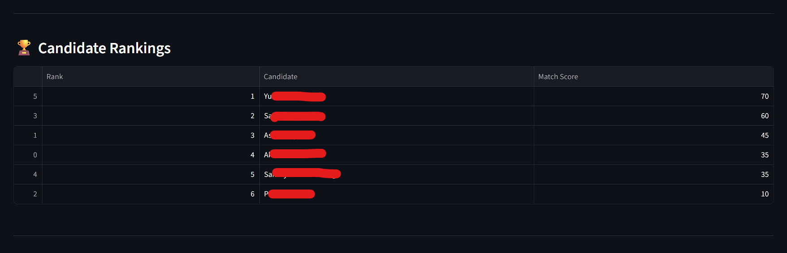
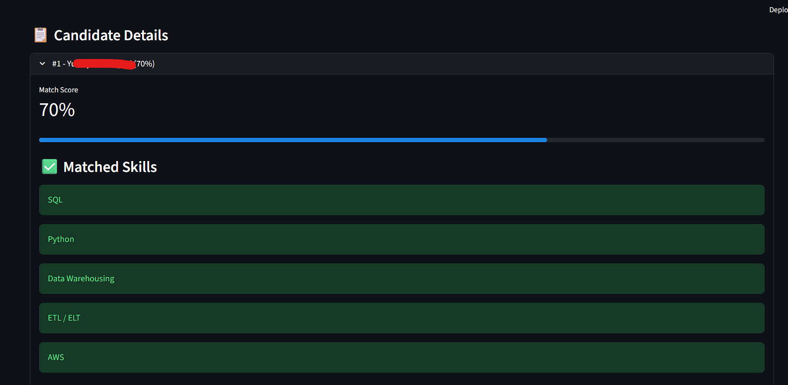
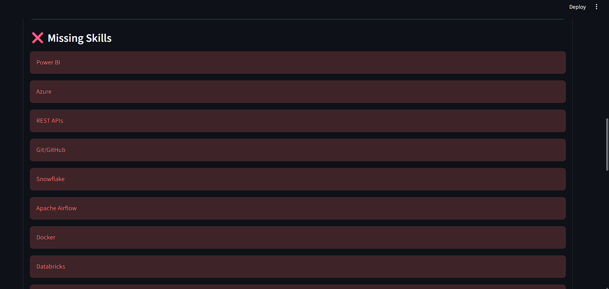
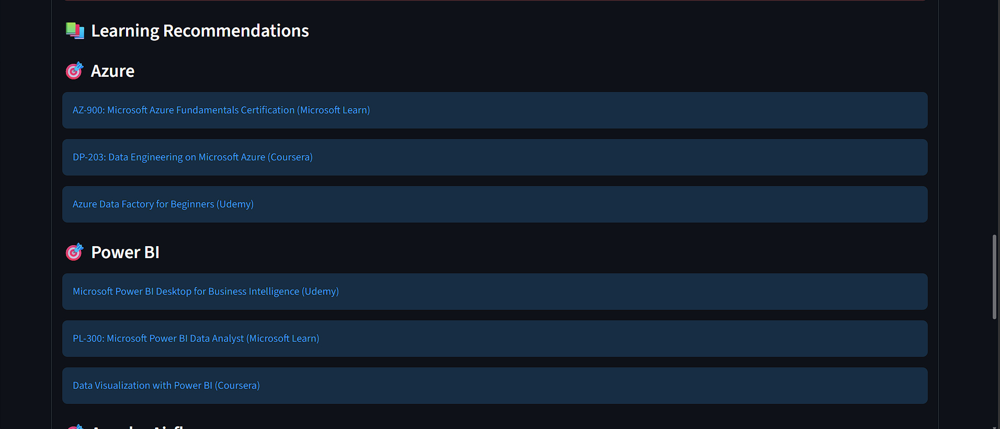
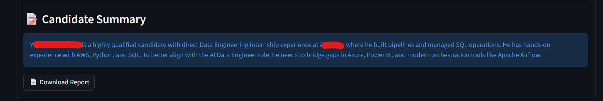
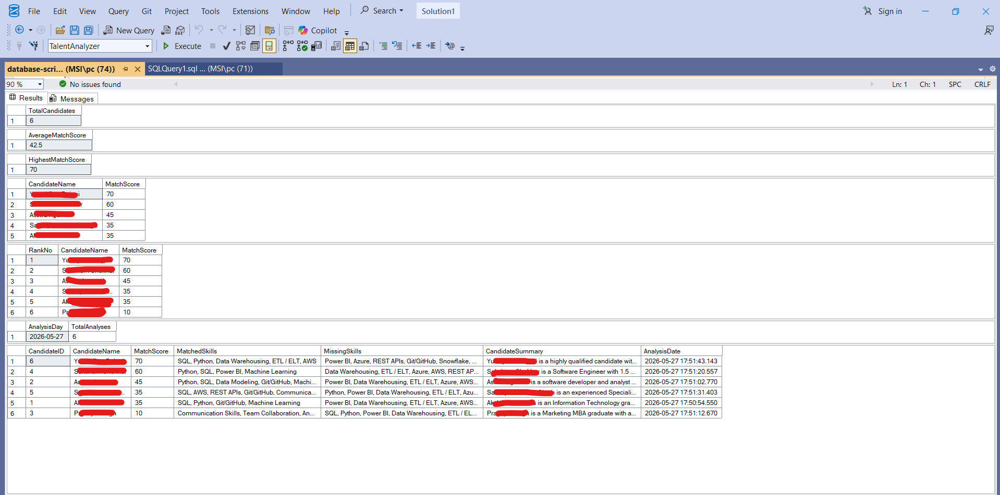
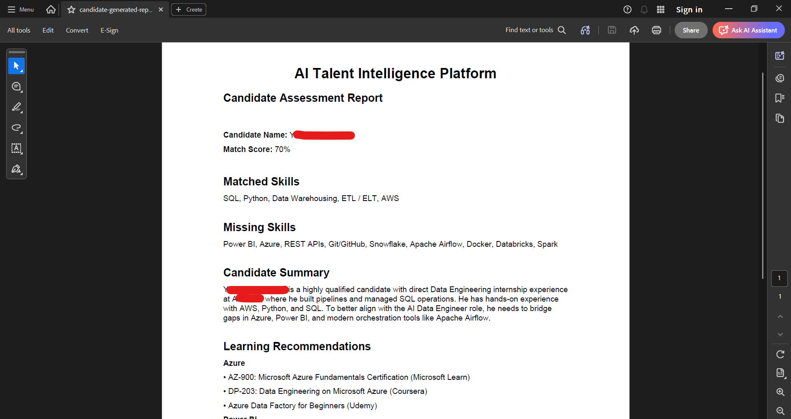
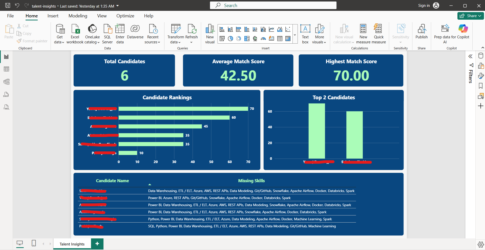

# 🚀 AI Talent Intelligence Platform

An end-to-end AI-powered recruitment analytics platform that automates resume screening, candidate-job matching, skill gap analysis, learning recommendations, PDF report generation, and hiring insights visualization.

---

## 📌 Project Overview

Recruiters often spend significant time manually reviewing resumes and comparing candidates against job requirements.

This platform streamlines the process by:

- Parsing resumes automatically
- Extracting technical skills using Gemini AI
- Matching candidates against Job Descriptions
- Identifying missing skills and skill gaps
- Recommending personalized learning paths
- Ranking candidates based on suitability
- Storing analysis results in SQL Server
- Generating downloadable PDF reports
- Visualizing hiring insights through Power BI

---

## 🏗️ System Architecture



### Workflow

Resume PDFs
→ Streamlit Application
→ Gemini AI Skill Analysis
→ Candidate Matching Engine
→ SQL Server Database
→ PDF Report Generation
→ Power BI Dashboard

---

## ✨ Key Features

### 🤖 AI Resume Analysis
- PDF resume parsing
- Skill extraction using Gemini AI
- Candidate profiling

### 🎯 Candidate Matching
- Job Description comparison
- Match score calculation
- Skill gap detection

### 📚 Learning Recommendations
- Personalized upskilling suggestions
- Missing skill analysis
- Career development guidance

### 🏆 Candidate Ranking
- Multi-candidate comparison
- Rank-based evaluation
- Recruiter-friendly insights

### 🗄️ SQL Server Integration
- Persistent candidate storage
- Historical analysis tracking
- Dashboard-ready data model

### 📄 Automated Report Generation
- Candidate assessment reports
- PDF export functionality
- Recruiter-ready summaries

### 📊 Power BI Dashboard
- Candidate ranking visualization
- Match score analytics
- Skill gap trends
- Hiring insights

---

# 🛠️ Tech Stack

| Category | Technology |
|-----------|------------|
| Frontend | Streamlit |
| AI Engine | Gemini AI |
| Programming Language | Python |
| Database | SQL Server (SSMS) |
| Analytics | Power BI |
| PDF Processing | PyPDF |
| Reporting | ReportLab |
| Data Handling | Pandas |
| Connectivity | PyODBC |

---

# 📁 Repository Structure

```text
AI-Talent-Match-Analyzer
│
├── insights-dashboard/
│
├── python-scripts/
│   ├── app.py
│   ├── config.py
│   ├── database.py
│   ├── report_generator.py
│   └── skill_extractor.py
│
├── screenshots/
│   ├── home-page.png
│   ├── home-page-details.png
│   ├── candidate-rankings.png
│   ├── analysis-matched-skills.png
│   ├── analysis-missing-skills.png
│   ├── analysis-learning-recommendations.png
│   ├── analysis-candidate-summary.png
│   ├── generated-pdf-report.png
│   ├── sql-server-data.png
│   ├── dashboard-insights.png
│   └── data-architecture.png
│
├── sql-db-script/
│   └── database-script.sql
│
├── requirements.txt
├── .gitignore
└── README.md
```

---

# 📷 Application Screenshots

## Home Page



---

## Candidate Ranking



---

## Matched Skills Analysis



---

## Missing Skills Analysis



---

## Learning Recommendations



---

## Candidate Summary



---

## SQL Server Data Storage



---

## Generated PDF Report



---

## Power BI Dashboard



---

# ⚙️ Installation Guide

## Clone Repository

```bash
git clone https://github.com/Akarsh-Kapoor/AI-talent-match-analyzer.git
cd AI-talent-match-analyzer
```

## Install Dependencies

```bash
pip install -r requirements.txt
```

## Configure Gemini API

Create a `.env` file:

```env
GEMINI_API_KEY=YOUR_API_KEY
```

## Setup SQL Server

Run:

```sql
sql-db-script/database-script.sql
```

inside SQL Server Management Studio.

## Run Application

```bash
streamlit run python-scripts/app.py
```

---

# 📈 Power BI Dashboard Metrics

The dashboard provides:

- Total Candidates
- Average Match Score
- Highest Match Score
- Candidate Ranking Distribution
- Skill Gap Analysis
- Learning Recommendation Trends
- Candidate Performance Insights

---

# 🎯 Business Value

This platform helps recruiters:

- Reduce manual screening effort
- Improve hiring efficiency
- Identify skill gaps quickly
- Compare candidates objectively
- Generate recruiter-ready reports
- Make data-driven hiring decisions

---

# 🔮 Future Enhancements

- Resume Batch Processing
- ATS Integration
- Interview Recommendation Engine
- Candidate Shortlisting Automation
- Resume Similarity Detection
- Real-Time Dashboard Refresh
- Cloud Deployment (Azure/AWS)

---

# 👨‍💻 Author

### Akarsh Kapoor

Data Analyst | Business Intelligence | AI & Analytics Enthusiast

- SQL
- Python
- Power BI
- Azure
- AWS
- Data Warehousing
- Business Intelligence

GitHub: https://github.com/Akarsh-Kapoor

---

⭐ If you found this project interesting, consider giving it a star.
